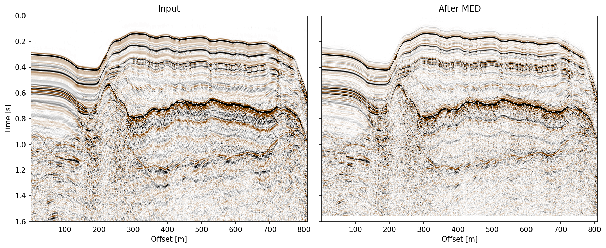
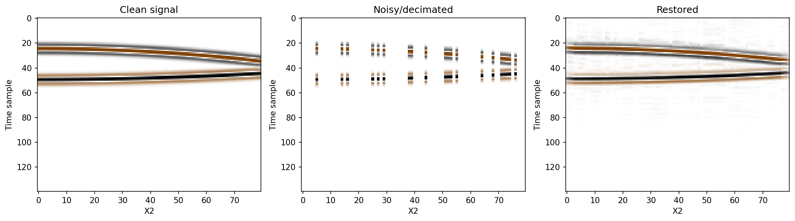
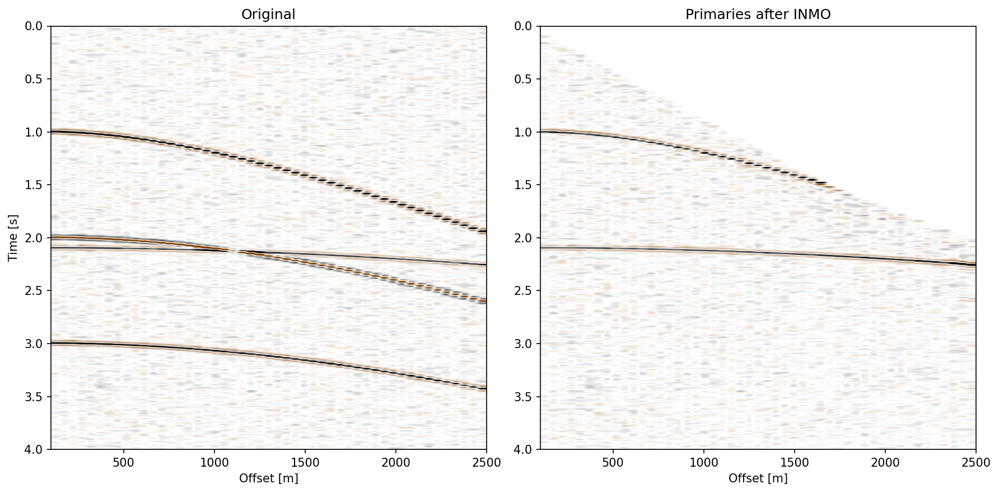
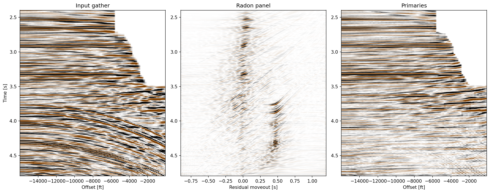
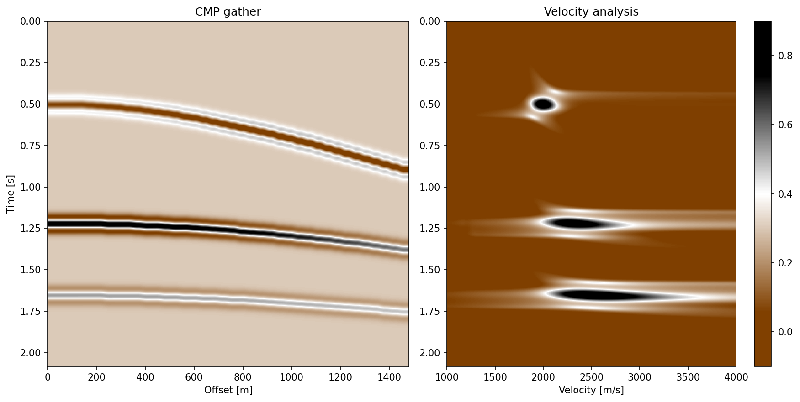

# SeismicLab 示例程序文档

本文档展示了 SeismicLab 库中所有示例程序的运行结果和可视化图片。

## 目录

1. [去噪方法](#去噪方法)
2. [动校正与时差校正](#动校正与时差校正)
3. [Radon变换](#radon变换)
4. [反褶积](#反褶积)
5. [其他技术](#其他技术)

---

## 去噪方法

### 1. FX反褶积去噪 (FX Deconvolution)

**文件**: [fx_decon_demo.py](../examples/fx_decon_demo.py)

**功能**: 使用FX域预测反褶积压制地震数据中的随机噪声。

**方法**:
- 生成线性事件合成道集
- 添加随机噪声(信噪比=2)
- 在频率-空间域应用预测反褶积
- 对比去噪前后的信噪比

**结果图片**: 

**关键参数**:
- `lf=5`: 滤波器长度
- `mu=0.01`: 正则化参数
- `flow=1.0, fhigh=100.0`: 频带范围

---

### 2. 中值滤波去噪 (Median Filter)

**文件**: [med_demo.py](../examples/med_demo.py)

**功能**: 使用最小熵反褶积(MED)对近偏移距数据进行滤波,压缩子波并提高分辨率。

**方法**:
- 读取近偏移距地震数据
- 应用MED算法进行迭代滤波
- 显示滤波前后的地震剖面
- 分析功率谱变化

**结果图片**:
- 地震剖面对比: 
- 功率谱对比: 

**关键参数**:
- `Nf=21`: 滤波器长度
- `mu=0.01`: 正则化参数
- `Updates=24`: 迭代次数

---

### 3. POCS插值/去噪 (Projection Onto Convex Sets)

**文件**: [pocs_demo.py](../examples/pocs_demo.py)

**功能**: 使用凸集投影(POCS)算法恢复三维数据中的缺失采样点。

**方法**:
- 生成三维抛物线事件数据体
- 随机抽零(80%数据缺失)
- 应用POCS算法恢复缺失数据
- 对比干净、破坏和恢复后的数据

**结果图片**:
- 切面对比: 
- Wiggle图显示: 

**关键参数**:
- `f_low=0.1, f_high=90.0`: 频带范围
- `N=100`: 最大迭代次数
- `a=0.6`: 松弛因子

---

## 动校正与时差校正

### 4. 动校正 (Normal Moveout)

**文件**: [moveout_demo.py](../examples/moveout_demo.py)

**功能**: 对CMP道集进行NMO校正和反NMO校正。

**方法**:
- 读取合成CMP道集
- 应用给定速度函数进行NMO校正
- 进行反NMO校正恢复原始时间
- 对比校正前后的道集

**结果图片**: 

**关键参数**:
- `tnmo=[0.5, 1.22, 1.65]`: NMO时深点
- `vnmo=[2000.0, 5000.0, 2500.0]`: 对应速度(m/s)
- `max_stretch=400.0`: 最大拉伸百分比

---

### 5. 抛物线时差校正 (Parabolic Moveout)

**文件**: [parabolic_moveout_demo.py](../examples/parabolic_moveout_demo.py)

**功能**: 计算抛物线残余时差谱以突出剩余时差能量分布。

**方法**:
- 对多次波道集进行NMO校正
- 计算抛物线残余时差谱
- 显示原始数据、NMO后数据和残余时差谱

**结果图片**: 

**关键参数**:
- `qmin=-0.5, qmax=1.2, nq=120`: 残余时差范围
- `R=1, L=20`: 正则化参数和窗长

---

## Radon变换

### 6. 高分辨率Radon去多次 (Radon Demultiple - Synthetic)

**文件**: [radon_demo_1.py](../examples/radon_demo_1.py)

**功能**: 使用高分辨率抛物线Radon变换分离多次波和一次波。

**方法**:
- 合成CMP道集经NMO校正
- 应用抛物线Radon变换
- 在Radon域分离多次波
- 反变换得到一次波

**结果图片**:
- Radon处理流程: 
- 时间域对比: 

**关键参数**:
- `qmin=-0.3, qmax=0.8, nq=60`: 残余时差范围
- `mu=1.0`: 正则化参数
- `method="hr"`: 高分辨率方法

---

### 7. 实测数据Radon去多次 (Radon Demultiple - Field Data)

**文件**: [radon_demo_2.py](../examples/radon_demo_2.py)

**功能**: 对实际海上CDP数据进行Radon去多次波处理。

**方法**:
- 读取NMO后的海上CDP数据
- 应用最小二乘Radon变换
- 显示输入、Radon面板和一次波
- 对比处理前后的残余时差谱

**结果图片**:
- Radon处理: 
- 时差谱对比: 

**关键参数**:
- `qmin=-0.9, qmax=1.2, nq=180`: 残余时差范围
- `mu=10.2`: 正则化参数
- `method="ls"`: 最小二乘方法

---

## 反褶积

### 8. 稀疏反褶积 (Sparse Deconvolution)

**文件**: [sparse_decon_demo.py](../examples/sparse_decon_demo.py)

**功能**: 利用稀疏约束从地震数据中恢复反射系数。

**方法**:
- 读取叠前数据和子波
- 应用稀疏反褶积算法
- 生成反射系数序列
- 对比输入、反射系数和预测数据

**结果图片**: 

**关键参数**:
- `max_iter=20`: 最大迭代次数
- `mu=1.1`: 正则化权重

---

### 9. 尖脉冲反褶积 (Spiking Deconvolution)

**文件**: [spiking_decon_demo.py](../examples/spiking_decon_demo.py)

**功能**: 应用尖脉冲反褶积压缩子波,提高时间分辨率。

**方法**:
- 生成或加载测试子波和地震记录
- 应用尖脉冲反褶积算法
- 对比处理前后的波形和频谱

**结果图片**: 

**关键参数**:
- `lf=50`: 滤波长度
- `prewhitening=0.1`: 预白化参数

---

## 其他技术

### 10. Spitz FX插值 (Spitz FX Interpolation)

**文件**: [spitz_demo.py](../examples/spitz_demo.py)

**功能**: 在频率-偏移域对稀疏道集进行插值。

**方法**:
- 读取NMO校正后的稀疏道集
- 应用Spitz FX插值算法
- 生成2倍密度的道集
- 以wiggle和幅度图显示结果

**结果图片**:
- Wiggle图: 
- 幅度图: 

**关键参数**:
- `npf=25`: 预测步长
- `pre1=1.0, pre2=1.0`: 预白化参数
- `flow=0.1, fhigh=90.0`: 频带范围

---

### 11. 速度分析 (Velocity Analysis)

**文件**: [va_demo.py](../examples/va_demo.py)

**功能**: 对CMP道集进行速度扫描,生成速度谱。

**方法**:
- 读取合成CMP道集
- 在给定速度范围内扫描
- 计算叠加能量
- 显示CMP道集和速度谱

**结果图片**: 

**关键参数**:
- `vmin=1000.0, vmax=4000.0, nv=150`: 速度扫描范围
- `R=1, L=15`: 正则化参数和窗长

---

## 图片列表

本示例程序共生成16张图片,存储在 [docs/figs/](figs/) 目录:

1. fx_decon_demo.png - FX反褶积去噪
2. med_demo.png - MED滤波剖面
3. med_demo_spectrum.png - MED功率谱
4. moveout_demo.png - NMO/INMO校正
5. parabolic_moveout_demo.png - 抛物线时差谱
6. pocs_demo.png - POCS恢复
7. pocs_demo_wiggle.png - POCS wiggle图
8. radon_demo_1.png - 合成数据Radon处理
9. radon_demo_1_comparison.png - 合成数据Radon对比
10. radon_demo_2.png - 实测数据Radon处理
11. radon_demo_2_spectrum.png - 实测数据时差谱
12. sparse_decon_demo.png - 稀疏反褶积
13. spiking_decon_demo.png - 尖脉冲反褶积
14. spitz_demo.png - Spitz插值幅度图
15. spitz_demo_wiggle.png - Spitz插值wiggle图
16. va_demo.png - 速度分析

---

## 如何运行示例

所有示例程序位于 [examples/](../examples/) 目录。运行单个示例:

```bash
cd examples
python fx_decon_demo.py
```

运行所有示例:

```bash
cd examples
python run_all_demos.py
```

生成所有图片到 `docs/figs/`:

```bash
python examples/generate_figs.py
```

---

## 技术说明

### 数据格式
- 输入数据格式: SU (Seismic Unix)
- 输出图片格式: PNG (150 DPI)

### 依赖环境
- Python 3.8+
- numpy
- matplotlib
- scipy
- seismiclab

### 环境设置
示例使用conda环境 `dasQt` 运行:

```bash
conda activate dasQt
```

---

## 参考文献

1. Gulunay, N., 1986, FX deconvolution: 56th Annual International Meeting, SEG, Expanded Abstracts, 279-281.

2. Spitz, S., 1991, Pattern recognition, spatial predictability, and subtraction of multiple events: The Leading Edge, 10, no. 1, 18-25.

3. Thorson, J. R., and J. F. Claerbout, 1985, Velocity-stack and slant-stack stochastic inversion: Geophysics, 50, 2727-2741.

4. Abma, R., and N. Kabir, 2006, 3D interpolation of irregular data with a POCS algorithm: Geophysics, 71, no. 6, E91-E97.

---

**文档生成时间**: 2025-12-27

**SeismicLab版本**: 0.1.0
